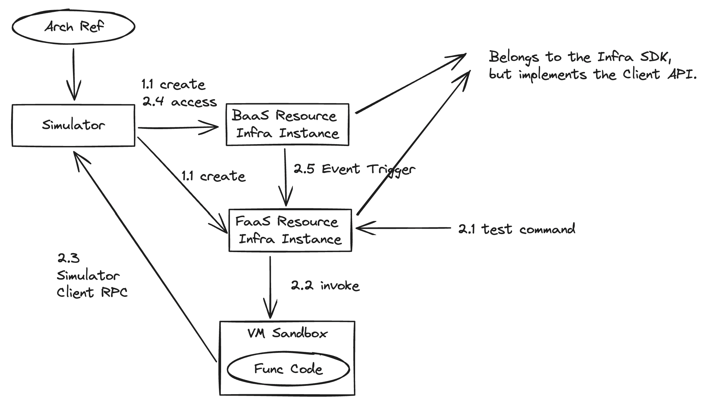

> Implement the design based on Winglang.

The basic idea is to create a Simulator component to simulate instances of resource components and expose services through an HTTP server. The FaaS component does not execute within the Simulator environment, but in a separate VM environment. When calling each BaaS component, it will interact with the Simulator via RPC to complete the function invocation.

## Construction Basis

The Simulator sequentially constructs each BaaS component resource based on the resource list in Arch Ref. Then, each item in the relationship list is configured as an Event Handler, where the "from" resource is the event initiator and the "to" resource is the event handler. The operation name represents the event type, and the parameters are the event configurations. The "from" resource adds its own Event Handler list based on these configurations and decides whether and how to trigger events based on its own execution status.

## Outline of Resource Implementation

The capability provided externally is the Infra type of the resource, but what is implemented is the Client API. In the Simulator, the Infra API does not function. The Client of each resource in the Client SDK is the Client of the Simulator, used for RPC calls to the Infra instance's API.

## Testing Workflow

1. Execute "pluto test --sim".
2. The test command calls the deducer to deduce and construct the arch ref.
3. The test command calls the generator to generate the computation module.
4. The test command calls the simulator adaptor to build the simulator based on the arch ref and obtain the simulator's URL.
   1. Build the arch topology.
   2. Iterate through the resources, load dependencies, and create client instances based on the resource type and parameters.
   3. Iterate through the relationships and add Event Handlers to the "from" resources.
5. The test command communicates with the corresponding tester instance within the simulator, identified by the tester's ID. It triggers the test case and retrieves the execution result.
   1. Tester instance find the compute closure based on test case information.
   2. Invoke the compute closure.
6. The test command displays the test results.
